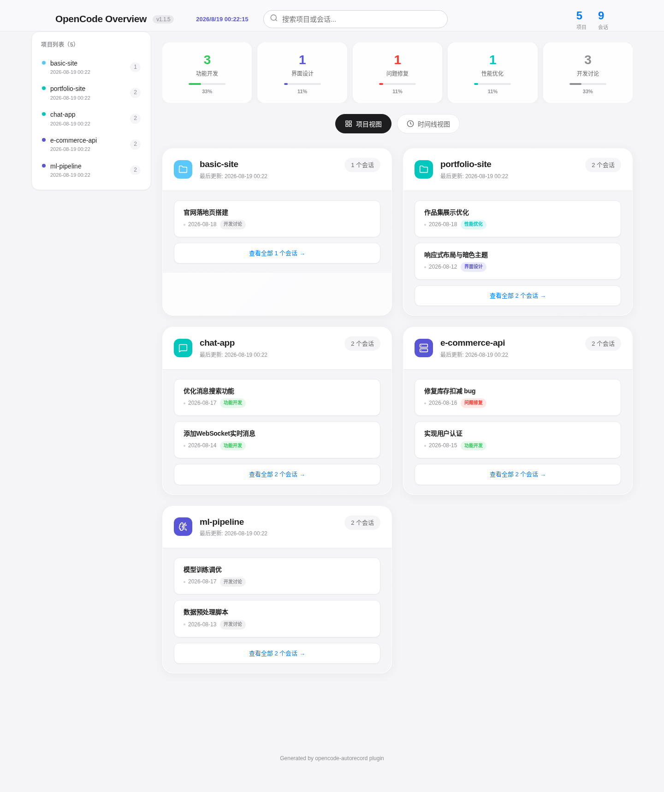
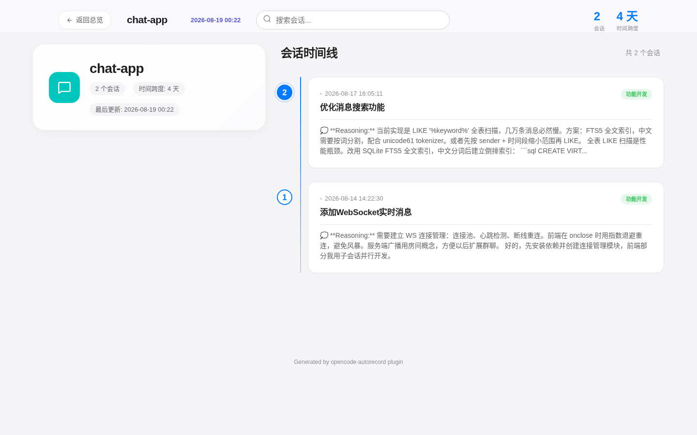
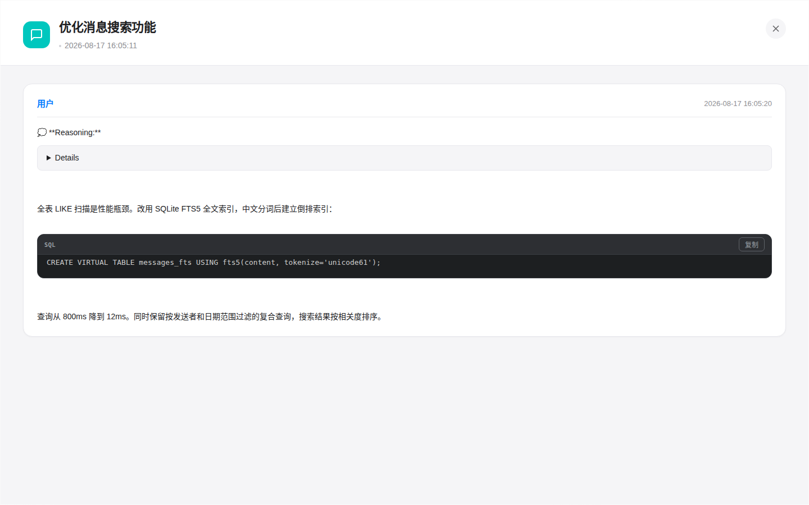

# opencode-autorecord

> Author: https://github.com/kevinsoul
>
> Main purpose: Save all OpenCode session records / 主要作用：保存所有 opencode 的会话记录

> Reference: https://github.com/learningpro/opencode-autosave-conversation

> Website: http://www.claode.cn / 官网：http://www.claode.cn


## Key Improvements / 优化与改动

1. Added parent session debounce for child session idle events (performance/repetitive writes) / 子会话 idle 时缺少对父会话的 debounce（性能/重复写入问题）
2. Added error isolation for child session reads (robustness) / 子会话读取没有错误隔离（健壮性问题）
3. Fixed data loss risk during `session.deleted` (timing issues) / `session.deleted` 时存在数据丢失风险（时序问题）
4. Fixed `convertMessages` pseudo-async function (code quality) / `convertMessages` 是伪异步函数（代码质量问题）
5. Parallelized image processing (performance) / 图片处理未并行化（性能问题）
6. Added message cache to avoid fetching full history on every idle / 没有消息缓存，每次 idle 都请求全量历史
7. Centralized storage in ~/opencode-autorecord instead of per-project directories / 不保存到项目目录，集中保存在 ~/opencode-autorecord

8. **Fixed click interaction issues** (v1.1.3) / **修复点击交互问题**（v1.1.3）：
   - Fixed project cards not opening the session list / 修复点击项目卡片无法弹出会话列表的问题
   - Fixed session cards not opening the conversation record / 修复点击会话卡片无法弹出会话记录的问题
   - Improved search filtering with Chinese content support / 优化搜索过滤功能，支持中文内容搜索

9. **Fixed homepage display issues** (v1.1.4) / **修复主页显示问题**（v1.1.4）：
   - Removed the session list below project cards on the homepage / 移除主页项目卡片下方的会话记录列表
   - The homepage now only shows a project overview (name, last updated, session count) / 主页现在只显示项目概览（名称、最后更新时间、会话数量）
   - Clicking a project card opens the full session details in a modal / 点击项目卡片后，在弹窗中查看完整会话详情

10. **Refactored file management & dual-tier HTML views** (v1.1.5) / **重构文件管理与双级 HTML 视图**（v1.1.5）：
   - Code language detection for tool calls / 工具调用代码语言检测
   - Related-topic sessions merged into a single file / 相同话题的会话合并到同一文件
   - Dual-tier HTML views: `opencode-overview.html` (metadata only) + `projects/<project>.html` (full conversations) / 双级 HTML 视图：主索引页（仅元数据）+ 各项目页（完整对话）
   - Stale project pages auto-removed on regeneration / 残留项目页面在视图再生成时自动清理


## Installation / 安装

### Plugin Usage (Recommended) / 插件使用（推荐）

**No manual installation is required.** Just add the plugin to your `opencode.json`: / **无需手动安装**，只需在 `opencode.json` 中添加插件配置：

```json
{
  "plugin": ["opencode-autorecord"]
}
```

OpenCode installs npm plugins automatically using Bun at startup, and caches packages and their dependencies in `~/.cache/opencode/node_modules/`. See the [official documentation](https://opencode.ai/docs/plugins/#how-plugins-are-installed) for details. / OpenCode 启动时会自动使用 Bun 安装 npm 插件，包及其依赖缓存于 `~/.cache/opencode/node_modules/`。详见[官方文档](https://opencode.ai/docs/plugins/#how-plugins-are-installed)。

Configuration file locations (in order of priority): / 配置文件位置（按优先级排序）：

1. **Project-level**: `./opencode.json` (current working directory) / **项目级配置**：`./opencode.json`（当前工作目录）
2. **User-level**: `~/.config/opencode/opencode.json` / **用户级配置**：`~/.config/opencode/opencode.json`

> **Note**: The plugin works as long as it's added to at least one configuration file. Adding it to the user-level config is recommended so all projects automatically save session records. / **注意**：至少需要在一个位置的配置文件中添加插件，插件即可生效。建议添加到用户级配置，这样所有项目都会自动保存会话记录。

### CLI Installation / CLI 安装

The CLI command is independent of the plugin and requires manual installation: / CLI 命令独立于插件，需要手动安装：

```bash
npm install -g opencode-autorecord
```


## Directory Structure / 目录结构

```
user-home/ / 用户目录/
└── opencode-autorecord/
    ├── opencode-overview.html          # main index page (metadata only) / 主索引页（仅元数据）
    ├── projects/                       # project pages (full conversations) / 项目页（完整对话）
    │   ├── your-project.html
    │   └── ...
    ├── .autorecord-index.json          # global index (v2) / 全局主索引
    └── your-project/
        ├── images/
        │   ├── 20250129-10-30-45-topic-0.png
        │   └── 20250129-10-30-45-topic-1.jpg
        ├── 20250129-10-30-45-implement-auth.md
        └── 20250129-14-22-30-fix-bug.md
```


## Features / 功能特性

- Automatic file creation when starting a new conversation / 开始新对话时自动创建文件（`~/opencode-autorecord`）
- Auto-saves to markdown files when session is idle (silent execution, no console output) / 会话空闲时自动保存为 markdown 文件（静默执行，无控制台输出）
- Files named by timestamp and topic: `YYYYMMDD-HH-MM-SS-topic.md` / 文件按时间戳和主题命名：`YYYYMMDD-HH-MM-SS-主题.md`
- Images saved as separate files instead of base64 (keeps Markdown clean) / 图片保存为独立文件，而非 base64（保持 Markdown 简洁）
- Full tool call details preserved (inputs and outputs) / 完整保留工具调用详情（输入和输出）
- Child sessions (subagent tasks) inlined within parent files / 子会话（subagent 任务）内联在父文件中
- Clean, readable Markdown format / 简洁易读的 Markdown 格式
- UTF-8 support for Chinese and other Unicode content / 支持中文及其他 Unicode 内容
- Two-tier HTML views: `opencode-overview.html` (metadata only) links to per-project pages in `projects/<project-name>.html` (full conversations with dark-themed code blocks, language labels, and copy buttons) / 双级 HTML 视图：主索引页（`opencode-overview.html`）仅含元数据，点击跳转到各项目页（`projects/<项目名>.html`）查看完整对话
- Session detail modals: clicking a session card opens a fullscreen modal with dark code blocks, language labels, and copy buttons / 会话详情弹窗：项目页中点击会话卡片弹出全屏弹窗，深色代码块带语言标签和复制按钮，提升阅读体验
- Stale project pages are auto-removed on every view regeneration: pages in `projects/` whose project folders no longer exist are deleted (`cleanupStaleProjectPages`) / 残留页面清理：每次视图再生成时删除 `projects/` 中已不存在项目对应的 `.html` 页面


## Preview / 效果预览

Main index page — project cards with session timeline / 主索引页——项目卡片与会话时间线：



Project page — full conversation with dark code blocks / 项目页——完整对话与深色代码块：



Session detail modal — click any session to browse the full record / 会话详情弹窗——点击任意会话查看完整记录：




## CLI / CLI 命令行工具

Besides running as an OpenCode plugin, a CLI command is provided to manually regenerate the HTML views. / 除了作为 OpenCode 插件自动运行外，还提供了 CLI 命令用于手动重新生成视图。

```bash
# Using the globally installed command / 使用全局安装的命令
opencode-autorecord regenerate ~/opencode-autorecord

# Or via npx (no global install required) / 或使用 npx（无需全局安装）
npx opencode-autorecord regenerate ~/opencode-autorecord
```

**Arguments / 参数说明：**

- `regenerate`: regenerate command / 重新生成命令
- `<save-directory>`: the root path of the global save directory — must be `~/opencode-autorecord` itself (it scans project subdirectories below it; passing a specific project directory will find no projects) / `<保存目录>`：全局保存目录的根路径，必须是 `~/opencode-autorecord` 本身（命令会扫描其下各项目子目录，传入具体项目目录会扫描不到任何项目）

**Notes / 功能说明：**

- Scans all Markdown files and generates `opencode-overview.html` (main index page, metadata only) plus `projects/<project-name>.html` (per-project pages, full conversations) / 扫描指定目录下的所有 Markdown 文件，生成 `opencode-overview.html`（主索引页，仅元数据）和每个项目的 `projects/<项目名>.html`（项目页，含完整对话，弹窗查看）
- Incremental scanning when `.autorecord-index.json` exists; full scan and index creation otherwise / 如果存在索引文件 `.autorecord-index.json`，将使用增量扫描；否则执行全量扫描并创建新的索引
- Project pages are rebuilt incrementally (only changed projects or those missing cached details); stale pages in `projects/` are auto-removed / 项目页增量重建：仅重建有变更或缓存缺少完整对话的项目，未变更项目直接跳过；残留页面自动清理

**Example / 示例：**

```bash
# Regenerate views (pass the root of the global save directory) / 重新生成视图（传入全局保存目录的根路径）
opencode-autorecord regenerate ~/opencode-autorecord
```

> **Windows users**: `~` is not expanded on Windows — use a full path like `C:\Users\<username>\opencode-autorecord` instead. See [Platform Notes](#platform-notes--平台说明). / **Windows 用户**：Windows 下 `~` 不会展开，请使用完整路径如 `C:\Users\<用户名>\opencode-autorecord`，详见[平台说明](#platform-notes--平台说明)。


## Platform Notes / 平台说明

### Linux / macOS (Default / 默认)

- Save directory: `~/opencode-autorecord` (i.e. `/home/<username>/opencode-autorecord`) / 保存目录：`~/opencode-autorecord`（即 `/home/<用户名>/opencode-autorecord`）
- User-level config: `~/.config/opencode/opencode.json` / 用户级配置文件：`~/.config/opencode/opencode.json`
- Plugin cache: `~/.cache/opencode/node_modules/` / 插件缓存目录：`~/.cache/opencode/node_modules/`
- The `~` in CLI paths is expanded by the shell, use it directly / CLI 路径中的 `~` 由 shell 自动展开，直接使用即可

### Windows / Windows 平台

The plugin is cross-platform: all paths are resolved via `os.homedir()` and Windows-illegal filename characters are automatically replaced with `-`. Differences to note: / 插件本身跨平台兼容：路径基于 `os.homedir()` 自动解析，文件名中的 Windows 非法字符会自动替换为 `-`。需要注意的差异：

- Save directory: `C:\Users\<username>\opencode-autorecord` (auto-resolved, no configuration needed) / 保存目录：`C:\Users\<用户名>\opencode-autorecord`（自动解析，无需配置）
- User-level config: `%USERPROFILE%\.config\opencode\opencode.json` / 用户级配置文件：`%USERPROFILE%\.config\opencode\opencode.json`
- **CLI caveat**: `~` is NOT expanded on Windows (Node does not handle shell `~`), so you must pass the full path / **CLI 注意**：Windows 下 `~` 不会被展开（Node 不处理 shell 的 `~`），必须传入完整路径：

  ```powershell
  # PowerShell (recommended / 推荐)
  opencode-autorecord regenerate C:\Users\<username>\opencode-autorecord

  # CMD
  opencode-autorecord regenerate %USERPROFILE%\opencode-autorecord
  ```

- **Filename restrictions**: Windows-illegal characters (`\ / : * ? " < > |`) are automatically replaced with `-`, but Windows reserved device names (`CON`, `NUL`, `COM1`, etc.) cannot be used as filenames — saving will fail if a project directory happens to be named that / **文件名限制**：Windows 非法字符（`\ / : * ? " < > |`）会被自动替换为 `-`；但 Windows 保留设备名（`CON`、`NUL`、`COM1` 等）不能作为文件名，若项目目录恰好叫这些名字会导致保存失败
- **Recommendation**: OpenCode officially recommends running in [WSL](https://opencode.ai/docs/windows-wsl/) for the best experience — inside WSL everything behaves as the Linux section above / **建议**：opencode 官方推荐在 [WSL](https://opencode.ai/docs/windows-wsl/) 中运行以获得最佳体验，WSL 内的行为与上方 Linux 一节完全一致

### Comparison / 对比一览

| 项目 Item | Linux / macOS | Windows |
| --- | --- | --- |
| 保存目录 Save directory | `~/opencode-autorecord` | `C:\Users\<用户名>\opencode-autorecord` |
| 用户级配置 User-level config | `~/.config/opencode/opencode.json` | `%USERPROFILE%\.config\opencode\opencode.json` |
| CLI 目录参数 CLI directory arg | `~/opencode-autorecord`（`~` 可展开） | 完整路径（`~` 不展开，如 `%USERPROFILE%\opencode-autorecord`） |
| 文件名非法字符 Illegal filename chars | `/` | `\ / : * ? " < > |`（自动替换为 `-`） |


## License / 许可证

[Apache 2.0](https://github.com/kevinsoul/opencode-autorecord/commit/6c59a77af7dafec32ebfcc9c892ed4b0f9a6a06f)